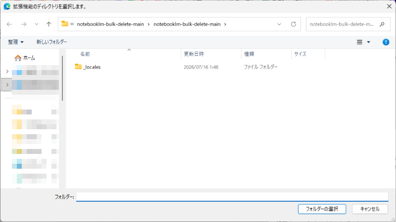

# NotebookLM 一括削除 (Chrome拡張)

NotebookLM (https://notebooklm.google.com) のホーム画面（ノートブック一覧）で、
複数のノートブックを選択して一括削除できるようにする Chrome 拡張機能 (Manifest V3) です。

## インストール手順

1. このリポジトリをダウンロードする（右上の「Code」→「Download ZIP」→展開、または `git clone`）
2. Chrome で `chrome://extensions` を開く
3. 右上の「デベロッパーモード」をONにする
4. 「パッケージ化されていない拡張機能を読み込む」をクリック
5. フォルダ選択画面で、展開したフォルダを開き、`manifest.json` がファイル一覧に見えるところまでさらに中のフォルダを開いていき、そのフォルダを選択する。（GitHubのZIPダウンロードは `notebooklm-bulk-delete-main` のような1段余分なフォルダで全体を包んでいるため、その外側のフォルダではなく、`manifest.json` や `content.js` が直接入っている内側のフォルダを選ぶこと。）

   

   このダイアログはフォルダしか表示しないため、`manifest.json` などのファイルは一覧に出てこない。上部のパスバー（例: `notebooklm-bulk-delete-main > notebookIm-bulk-delete-main` のようにフォルダ名が2回続く）で、正しく1段中に入っていることを確認してから「フォルダーの選択」を押すこと。
6. NotebookLM のホーム画面を開く（既に開いている場合はリロードする）

## 使い方

1. 画面右下に表示される「一括削除モード」ボタンをクリックする
2. 各ノートブックカードの左上にチェックボックスが表示されるので、削除したいものにチェックを入れる
   （画面下部のパネルの「全選択」「全解除」でまとめて操作も可能）
3. パネルの「選択したN件を削除」をクリックする
4. 確認ダイアログで「OK」を押すと、選択したノートブックを1件ずつ自動で
   （3点メニューを開く → 「削除」を選ぶ → 確認ダイアログで削除を押す）処理していきます
5. 進捗・エラーはパネル下部に表示されます

「一括削除モード」ボタンをもう一度押すか、パネルの「閉じる」でモードを終了できます。
