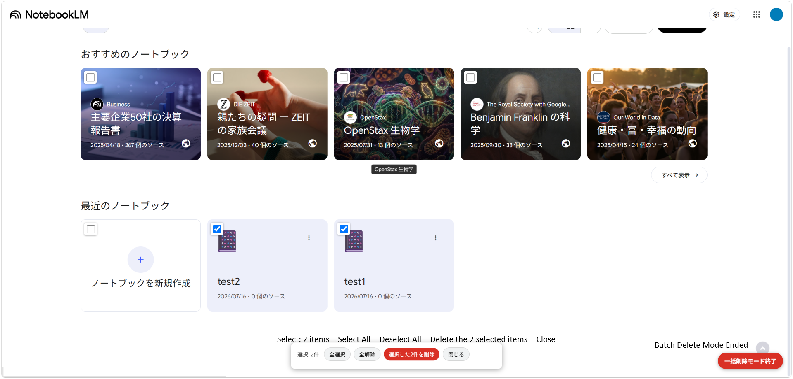

# NotebookLM Bulk Delete (Chrome Extension)

[日本語](README.ja.md)

A Chrome extension (Manifest V3) that lets you select multiple notebooks on the
NotebookLM (https://notebooklm.google.com) home screen (notebook list) and
delete them in bulk.

## Installation

1. Download this repository (top right "Code" → "Download ZIP" → extract it, or `git clone`)
2. Open `chrome://extensions` in Chrome
3. Turn on "Developer mode" in the top right
4. Click "Load unpacked"
5. In the folder picker, open the extracted folder and go one level further in if needed, until you can see `manifest.json` in the file list — then select that folder. (GitHub's ZIP download wraps everything in an extra folder like `notebooklm-bulk-delete-main`; make sure you select the inner folder that has `manifest.json`, `content.js`, etc. directly inside it, not the outer one.)

   

   Since this dialog only shows folders, files like `manifest.json` won't be listed — use the path bar at the top (showing the folder name twice, e.g. `notebooklm-bulk-delete-main > notebookIm-bulk-delete-main`) to confirm you're one level in, then click "Select Folder".
6. Open the NotebookLM home screen (reload it if it's already open)

## Usage

1. Click the "Bulk Delete Mode" button that appears in the bottom right of the screen
2. Checkboxes appear in the top-left corner of each notebook card — check the ones you want to delete
   (you can also use "Select All" / "Deselect All" in the panel at the bottom of the screen)
3. Click "Delete N selected" in the panel
4. Press "OK" in the confirmation dialog, and the selected notebooks are processed
   automatically one by one (open the 3-dot menu → choose "Delete" → confirm the delete dialog)
5. Progress and errors are shown at the bottom of the panel

You can exit the mode by clicking the "Bulk Delete Mode" button again, or by clicking "Close" in the panel.
